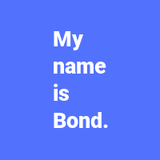

# Placeholder Image Generator

This package is intended to be used for quickly generating placeholder images with a specific size, color and text.

## Requirements

* PHP 7.0 or higher
* GD extension
    
## Usage

Make sure you require this package in your composer.json:

    composer require nicoverbruggen/image-generator

See [the example source file](example.php) that is used to generate an image. You can generate the following examples:

Please note that for testing purposes, I used Roboto Black as the TrueType font. This font is not included in this repository.

## Notes

If you do not supply a TrueType font path: 
* you will be limited in font size options (1 through 5)
*  you will not be able to render multiline text

## Contributions

I am not planning to expand the features of this package at this time. If you've made an improvement or fixed something, you are free to send me a pull request.

## License

MIT. 

See also: [LICENSE](LICENSE).