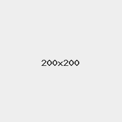
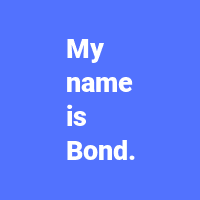

# Image Generator

This package is intended to be used for quickly generating placeholder images with a specific size, color and text. For more complex use cases, you may want to turn to something like [stil/gd-text](https://github.com/stil/gd-text).

## Requirements

* PHP 8.1 or higher
* GD extension
* TrueType font files (.tff, optional)

## Sample images

See [the example source files](examples/) to generate the sample images below.





## Installation

    composer require nicoverbruggen/image-generator

## Usage

I highly recommend using the easy **fluent API**. The [classic API](doc/classic.md) is also still fully supported but less easy to use.

### Save to a file

```php
use NicoVerbruggen\ImageGenerator\ImageGenerator;

ImageGenerator::text("Hello!")
    ->width(200)
    ->backgroundColor("#EEE")
    ->foregroundColor("#333")
    ->toPng(__DIR__ . "/placeholder.png");
```

### Generate a `base64` image

```php
use NicoVerbruggen\ImageGenerator\ImageGenerator;

$src = ImageGenerator::text("Hello!")
    ->width(200)
    ->toBase64();

echo "";
```

### Rectangles

Setting only `width` generates a square. Use `size()` or `height()` for rectangles:

```php
use NicoVerbruggen\ImageGenerator\ImageGenerator;

ImageGenerator::text("Banner")
    ->size(400, 100)
    ->backgroundColor("#005577")
    ->foregroundColor("#FFF")
    ->toPng(__DIR__ . "/banner.png");
```

### TrueType fonts and multiline text

```php
use NicoVerbruggen\ImageGenerator\ImageGenerator;

ImageGenerator::text("My\nname\nis\nBond.")
    ->width(200)
    ->font("/path/to/font.ttf", 20)
    ->lineHeight(1.6)
    ->toPng(__DIR__ . "/multiline.png");
```

### Using in Blade templates

First, you may want to set up a helper that you can call with whatever templating language you wish to use. My example here uses Blade, but the package is framework agnostic.

```php
use NicoVerbruggen\ImageGenerator\ImageGenerator;

function placeholder(int $size = 500): string {
    return ImageGenerator::text("{$size}x{$size}")
        ->width($size)
        ->toBase64();
}
```

It should be really easy to use in a view, like this:

```html
<div>
    <h3>Item</h3>
    
</div>
```

## Server mode

Also included in this package is a **server mode**. You can point your site's webroot to the `server` directory, and generate images on the fly via a dedicated URL.

The following `GET` parameters are supported:

- `size` — the dimensions of the placeholder image
- `background_color` — the background color (hex, without `#`)
- `text_color` — the text color (hex, without `#`)

You can then use that other domain to serve images dynamically:

```bladehtml

```

## Notes

If you do not supply a TrueType font path you will be limited in font size options (1 through 5) and you will not be able to render multiline text. Therefore, I always recommend using a custom TrueType font.

## Upgrade guide

### v2 to v3:

In `ImageGenerator`, `makePlaceholderImage()` has been removed. You need to replace all usages of it with `generate()`.

### v3 to v4:

In `ImageGenerator`, `generate()`'s `path` parameter has been replaced with `output`. If you use named parameters, you will need to update your usage of this method.

It works the same way, but you have more options for this parameter now, in particular `base64` is now a valid value for that parameter.

## Tests

    composer test

## Contributions

I am not planning to expand the features of this package at this time. If you've made an improvement or fixed something, you are free to send me a pull request.

## License

MIT.

See also: [LICENSE](LICENSE).
